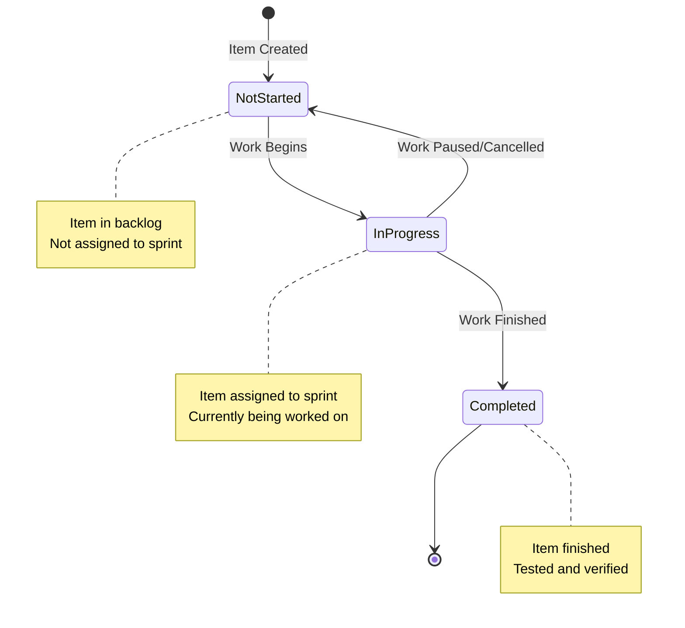
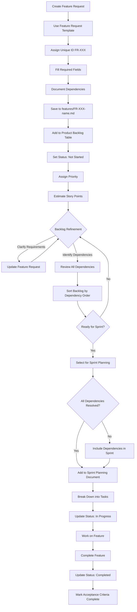
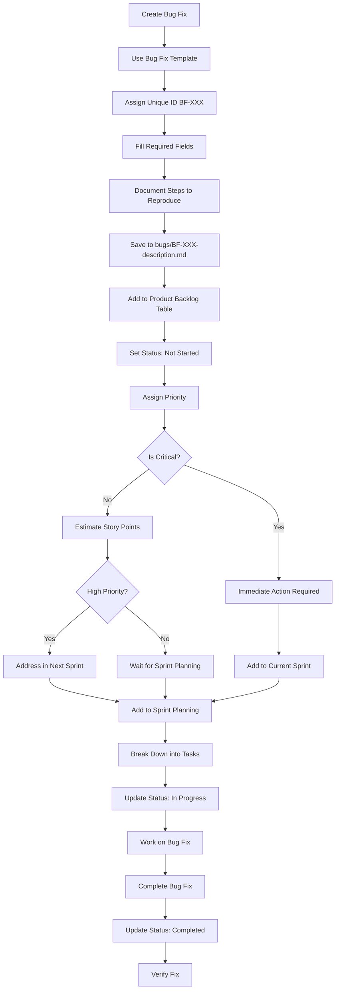

# Backlog Management Process

## Overview

This document defines the process for managing the product backlog, including how items are added, updated, prioritized, and linked to sprint planning.

**Reference**:

- Product Backlog Structure: [product-backlog-structure.md](product-backlog-structure.md)
- Sprint Planning Template: [../templates/sprint-planning-template.md](../templates/sprint-planning-template.md)

## Backlog Lifecycle

### Status Lifecycle

```
⭕ Not Started → ⏳ In Progress → ✅ Completed
```

**Status Definitions**:

- **⭕ Not Started**: Item is in backlog, not yet assigned to a sprint or started
- **⏳ In Progress**: Item is currently being worked on (assigned to active sprint)
- **✅ Completed**: Item is finished, tested, and verified

### Status Lifecycle Diagram

The following diagram visualizes the status transitions for backlog items:



## Adding Items to Backlog

### Feature Request Process

1. **Create Feature Request**:
    - Use feature request template
    - Assign unique ID (FR-XXX or your ID format)
    - Fill in all required fields
    - Save to `features/[ID]-feature-name.md`

2. **Add to Main Backlog**:
    - Add entry to product backlog table in `product-backlog.md`
    - Set initial status: ⭕ Not Started
    - Assign priority based on business value
    - Estimate story points

3. **Backlog Refinement**:
    - Review during backlog refinement session
    - Clarify requirements if needed
    - Update priority if needed
    - Break down into tasks if large

#### Feature Request Workflow Diagram

The following diagram shows the complete workflow for feature requests from creation to completion:



### Bug Fix Process

1. **Create Bug Fix**:
    - Use bug fix template
    - Assign unique ID (BF-XXX or your ID format)
    - Fill in all required fields including steps to reproduce
    - Save to `bugs/[ID]-bug-description.md`

2. **Add to Main Backlog**:
    - Add entry to product backlog table
    - Set initial status: ⭕ Not Started
    - Assign priority (bugs are often high priority)
    - Estimate story points

3. **Immediate Action**:
    - Critical bugs may need immediate attention
    - High priority bugs should be addressed in next sprint
    - Medium/Low priority bugs can wait for sprint planning

#### Bug Fix Workflow Diagram

The following diagram shows the complete workflow for bug fixes from creation to completion, including decision points for critical bugs:



## Updating Backlog Items

### When Work Begins

**Status Change**: ⭕ Not Started → ⏳ In Progress

**Actions**:

1. Update status in feature request/bug fix file
2. Update status in main backlog table
3. Add "Assigned Sprint" field
4. Add entry to sprint planning document
5. Update "Updated" date

**Example**:

```markdown
**Status**: ⏳ In Progress  
**Assigned Sprint**: Sprint 1  
**Updated**: 2024-01-15

## History

- 2024-01-10 - Created
- 2024-01-15 - Status changed to ⏳ In Progress, Assigned to Sprint 1
```

### When Work Completes

**Status Change**: ⏳ In Progress → ✅ Completed

**Actions**:

1. Update status in feature request/bug fix file
2. Update status in main backlog table
3. Mark acceptance criteria as complete
4. Add completion notes
5. Update "Updated" date
6. Update sprint planning document (mark story as complete)

**Example**:

```markdown
**Status**: ✅ Completed  
**Updated**: 2024-01-22

## History

- 2024-01-10 - Created
- 2024-01-15 - Status changed to ⏳ In Progress, Assigned to Sprint 1
- 2024-01-22 - Status changed to ✅ Completed
```

## Backlog Refinement

### Refinement Sessions

**Frequency**: Weekly or bi-weekly (adjust to your team's needs)

**Participants**: Product Owner, Scrum Master, Development Team

**Agenda**:

1. Review new backlog items
2. Clarify requirements for unclear items
3. Estimate story points for unestimated items
4. Identify and document dependencies
5. Sort backlog by dependency order
6. Prioritize items
7. Break down large items
8. Remove obsolete items

### Refinement Checklist

For each backlog item:

- [ ] Description is clear and complete
- [ ] User story is well-defined (As a... I want... So that...)
- [ ] Acceptance criteria are specific and testable
- [ ] Story points are estimated (Fibonacci: 1, 2, 3, 5, 8, 13)
- [ ] Priority is assigned (🔴 Critical / 🟠 High / 🟡 Medium / 🟢 Low)
- [ ] Technical references are included
- [ ] Dependencies are identified
- [ ] Business value is documented

## Dependency Management

### Identifying Dependencies

Dependencies should be documented in each backlog item's "Dependencies" section. Common dependency types include:

- **Blocking Dependencies**: Item A must be completed before Item B can start
- **Enabling Dependencies**: Item A makes Item B easier or better, but not strictly required
- **Technical Dependencies**: Item A requires specific technical infrastructure from Item B
- **Data Dependencies**: Item A requires data structures or APIs from Item B
- **Feature Dependencies**: Item A builds upon functionality in Item B

### Sorting Backlog by Dependencies

**Process**:

1. **Review All Dependencies**: Go through each backlog item and verify dependencies are documented
2. **Create Dependency Graph**: Map out which items depend on which other items
3. **Identify Dependency Chains**: Find items that have no dependencies (can start immediately)
4. **Order by Dependency**: Sort backlog so items with dependencies come after their prerequisites
5. **Resolve Circular Dependencies**: If circular dependencies exist, break them by:
    - Combining items if they're tightly coupled
    - Splitting items to remove the circular dependency
    - Identifying a minimal implementation that breaks the cycle

**Sorting Rules**:

- Items with no dependencies should be at the top (ready to start)
- Items that depend on completed items should come next
- Items with uncompleted dependencies should be lower in the backlog
- Within the same dependency level, sort by priority (Critical → High → Medium → Low)

**Example Dependency Ordering**:

```
1. FR-001: User Authentication (no dependencies) - 🔴 Critical
2. FR-002: User Profile (depends on FR-001) - 🟠 High
3. FR-003: User Settings (depends on FR-002) - 🟡 Medium
4. FR-004: Advanced Features (depends on FR-001, FR-002) - 🟠 High
```

### Dependency Sorting Checklist

- [ ] All dependencies are documented in backlog items
- [ ] Dependency graph is created and reviewed
- [ ] Items are sorted so prerequisites come first
- [ ] Circular dependencies are identified and resolved
- [ ] Backlog table is updated to reflect dependency order
- [ ] Items with blocked dependencies are clearly marked

## Prioritization Process

### Prioritization Criteria

1. **Business Value**: How important is this to users?
2. **Technical Risk**: How risky is the implementation?
3. **Dependencies**: What other work depends on this? (Items with no dependencies are prioritized first)
4. **Effort**: How much work is required?
5. **Urgency**: How time-sensitive is this?

**Note**: After sorting by dependencies, prioritize within each dependency level using the criteria above.

### Priority Assignment

**🔴 Critical**:

- Blocks core functionality
- Security issues
- Data loss risks
- Must be addressed immediately

**🟠 High**:

- Important features for MVP
- Significant user value
- Should be addressed in next 1-2 sprints

**🟡 Medium**:

- Nice to have features
- Moderate user value
- Can wait for future sprints

**🟢 Low**:

- Future considerations
- Low user value
- Can be deferred indefinitely

## Linking to Sprint Planning

### Sprint Planning Process

1. **Select Items from Backlog**:
    - Review dependency-sorted backlog items
    - Select items for sprint based on:
        - Dependency order (items with completed dependencies first)
        - Priority (within same dependency level)
        - Team velocity
        - Sprint goal
    - Ensure all dependencies for selected items are either:
        - Already completed
        - Included in the same sprint
        - Planned for earlier sprints

2. **Add to Sprint Planning Document**:
    - Copy feature request/bug fix details
    - Break down into tasks
    - Assign story points to tasks
    - Add technical references

3. **Update Backlog Status**:
    - Change status to ⏳ In Progress
    - Add "Assigned Sprint" field
    - Update main backlog table

### Sprint Planning Checklist

- [ ] Backlog sorted by dependencies
- [ ] Dependencies for selected items are resolved (completed or in sprint)
- [ ] Backlog items selected for sprint
- [ ] Items added to sprint planning document
- [ ] Items broken down into tasks
- [ ] Tasks have technical references
- [ ] Story points estimated
- [ ] Backlog status updated
- [ ] Sprint goal defined

## Backlog Maintenance

### Regular Updates

**Daily**:

- Update status of in-progress items
- Add notes on progress

**Weekly**:

- Review backlog during refinement
- Update dependencies as needed
- Re-sort backlog by dependency order
- Update priorities if needed
- Remove obsolete items

**Sprint End**:

- Mark completed items as ✅ Completed
- Review incomplete items
- Move incomplete items to next sprint or back to backlog

### Backlog Cleanup

**Remove Items**:

- Obsolete features (no longer needed)
- Duplicate items
- Items that have been replaced

**Archive Items**:

- Completed items (keep for reference)
- Cancelled items (document why)

## Backlog Metrics

### Tracking Metrics

**Backlog Size**:

- Total number of items
- Items by priority
- Items by status

**Velocity Tracking**:

- Story points completed per sprint
- Average velocity
- Velocity trends

**Cycle Time**:

- Time from creation to completion
- Time in each status

### Reporting

**Sprint Review**:

- Show completed items
- Show backlog status
- Discuss upcoming items

**Stakeholder Updates**:

- High-priority items status
- Upcoming features
- Blocked items

## Best Practices

### Writing Good Backlog Items

1. **Clear Description**: What needs to be done?
2. **User Story Format**: As a... I want... So that...
3. **Acceptance Criteria**: Specific, testable criteria
4. **Technical References**: Link to relevant documents
5. **Business Value**: Why is this important?

### Managing Backlog

1. **Keep It Updated**: Regular refinement and updates
2. **Sort by Dependencies**: Always maintain dependency order
3. **Prioritize Regularly**: Review priorities frequently (within dependency levels)
4. **Break Down Large Items**: Keep items manageable
5. **Document Decisions**: Record why items are prioritized
6. **Communicate Changes**: Keep team informed

## References

- **Product Backlog Structure**: [product-backlog-structure.md](product-backlog-structure.md)
- **Sprint Planning Template**: [../templates/sprint-planning-template.md](../templates/sprint-planning-template.md)
- **Feature Request Template**: [../templates/feature-request-template.md](../templates/feature-request-template.md)
- **Bug Fix Template**: [../templates/bug-fix-template.md](../templates/bug-fix-template.md)

## Git Commit Strategy

### Conventional Commits Specification

All team members must use Conventional Commits to maintain a clean, searchable git history.

**Message Structure**:

```
<type>(<scope>): <subject>

<body>

<footer>
```

**Type Definitions**:

| Type       | Description                  | Example                                         |
| ---------- | ---------------------------- | ----------------------------------------------- |
| `feat`     | New functionality            | `feat(prompt): Add template library sidebar`    |
| `fix`      | Bug fixes                    | `fix(llm): Resolve connection timeout issue`    |
| `docs`     | Documentation only           | `docs(readme): Update installation steps`       |
| `style`    | Code style changes           | `style: Format code with Pint`                  |
| `refactor` | Code restructuring           | `refactor(workflow): Simplify generation logic` |
| `test`     | Test additions/modifications | `test(prompt): Add PromptService unit tests`    |
| `chore`    | Maintenance tasks            | `chore: Update composer dependencies`           |
| `perf`     | Performance improvements     | `perf(llm): Cache model list response`          |
| `ci`       | CI/CD changes                | `ci: Add lint step to pipeline`                 |
| `build`    | Build system changes         | `build: Update Vite configuration`              |
| `revert`   | Revert previous commits      | `revert: Revert "feat(auth): Add OAuth"`        |

### Subject Line Requirements

1. **Maximum 50 characters** - Keep it concise
2. **Imperative mood** - "Add" not "Added", "Fix" not "Fixed"
3. **Capitalized first letter** - "Add new feature"
4. **No trailing period** - "Add new feature" not "Add new feature."
5. **Task ID prefix** - Include project task identifier

**Good Examples**:

```
feat(llm): Add Ollama provider support
fix(auth): Resolve session timeout issue
docs(readme): Update API documentation
```

**Poor Examples**:

```
feat: Added new feature for LLM support (too long, no scope)
feat(lang): added new feature (lowercase, past tense)
feat: Added support for Ollama (past tense)
```

### Body Requirements

**First Paragraph (Business Focus)**:

- Describe why the changes were made
- Focus on business value and user impact
- Explain the problem being solved
- Keep it to 2-3 sentences

**Second Paragraph (Technical Details)**:

- Use bullet points for clarity
- List technical implementation details
- Include architecture decisions
- Note any dependencies or system interactions
- Mention performance considerations

**Example Body**:

```
Enable users to connect to local LLM instances for improved privacy and cost savings.

- Add OllamaProvider class with HTTP client
- Implement connection test endpoint
- Add provider selection UI component
- Store API credentials encrypted in database
- Add unit tests for provider abstraction
```

### Footer Requirements

Reference related issues, pull requests, and backlog items:

- `Closes #123` - PR/issue resolved by this commit
- `Refs #456` - Related but not resolved
- `PROJECT-42` - Backlog item reference

**Example Footer**:

```
Closes #15
Refs: FR-006, PROJECT-101
```

### Commit Message Workflow

#### 1. Before Starting Work

```
# Create feature branch from main
git checkout main
git pull origin main
git checkout -b feat/FR-006-llm-connection
```

#### 2. During Development

Make atomic commits with clear, conventional messages:

```
git add app/Providers/LlmServiceProvider.php
git commit -m "feat(llm): Add LlmService provider abstraction

Implement service layer for LLM provider management enabling
support for multiple providers (Ollama, DeepSeek).

- Create LlmService class with provider interface
- Add OllamaProvider implementation
- Add connection test method
- Implement provider configuration storage

Refs: FR-006"
```

#### 3. Pull Request

- Ensure PR title follows conventional commit format
- Squash commits to maintain clean history
- Reference backlog item in PR description

#### 4. Merge Strategy

```
# Preferred: Squash and merge for feature branches
git merge --squash feat/FR-006-llm-connection

# Generate conventional commit message from PR title
# Example PR title: "feat(llm): Add Ollama provider support"
```

### Commit Message Checklist

- [ ] Type is one of: feat, fix, docs, style, refactor, test, chore, perf, ci, build, revert
- [ ] Scope is included in parentheses (e.g., `(llm)`, `(prompt)`)
- [ ] Subject line is 50 characters or less
- [ ] Subject uses imperative mood
- [ ] Subject is capitalized, no trailing period
- [ ] Body explains why (business value)
- [ ] Body includes technical implementation details
- [ ] Footer references related issues/backlog items
- [ ] All commits reference relevant backlog item (FR-XXX, BF-XXX, Sprint-XX)

### Backlog Item Commit References

| Backlog Item Type | Reference Format  | Example                                                 |
| ----------------- | ----------------- | ------------------------------------------------------- |
| Feature Request   | `Refs: FR-001`    | `feat(auth): Add login form\n\nRefs: FR-001`            |
| Bug Fix           | `Refs: BF-001`    | `fix(ui): Resolve mobile menu overlap\n\nRefs: BF-001`  |
| Sprint            | `Refs: Sprint-01` | `chore: Update sprint documentation\n\nRefs: Sprint-01` |

### Quality Gates

**Before Commit**:

- [ ] Code follows project style guidelines
- [ ] Tests pass locally
- [ ] Commit message follows conventional format

**Before PR**:

- [ ] All commits reference relevant backlog items
- [ ] Commits are atomic (one logical change per commit)
- [ ] History is clean and readable

**Before Merge**:

- [ ] PR title follows conventional commit format
- [ ] All related backlog items are referenced
- [ ] Documentation updated if needed

---

**Last Updated**: 2026-01-10
