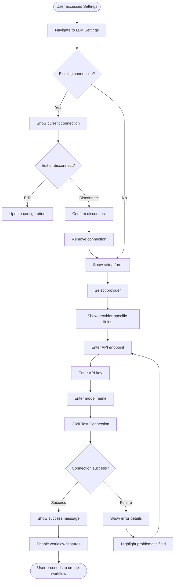
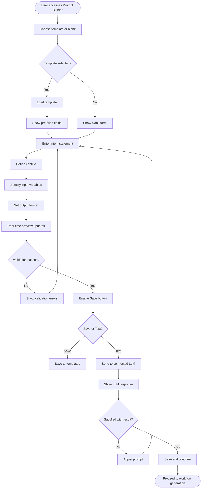
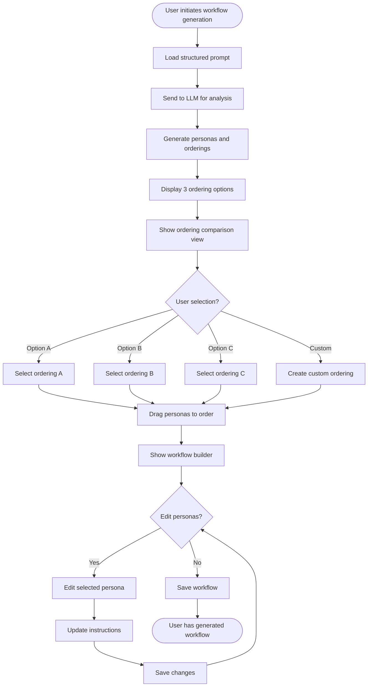
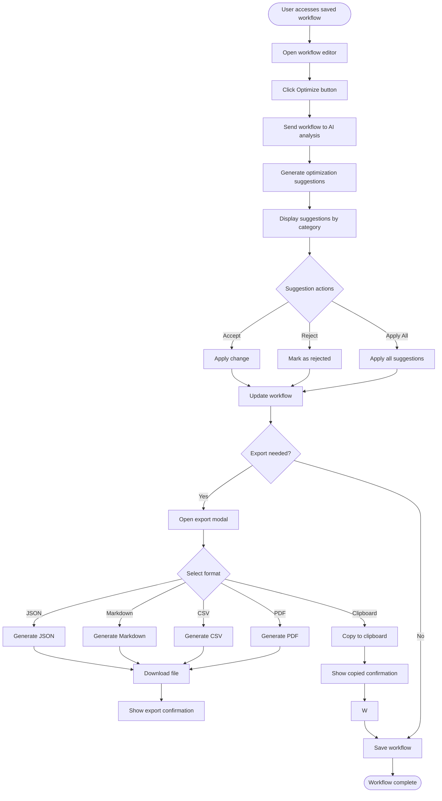

# UX Design Documentation - AI Workflow Generator

**Document Version**: 1.0  
**Created**: 2026-01-10  
**Last Updated**: 2026-01-10  
**Applicable Features**: FR-006, FR-007, FR-008, FR-009

---

## 1. User Personas

### Persona 1: The Curious Creator

**Name**: Sarah Chen  
**Age**: 34  
**Role**: Content Strategist & Marketing Manager  
**Company Size**: Mid-size startup (50-200 employees)  
**Technical Proficiency**: Low to Moderate

**Goals and Motivations**:

- Wants to create structured workflows for content creation without learning complex project management tools
- Needs to communicate clear instructions to AI for generating marketing materials
- Values time savings and consistency in outputs
- Wants to understand the reasoning behind AI-generated recommendations

**Pain Points and Frustrations**:

- Overwhelmed by too many AI tools with steep learning curves
- Frustrated when AI outputs don't match expectations due to unclear prompts
- Concerned about data privacy when using cloud AI services
- Wants transparency in how AI makes decisions

**Behavioral Patterns**:

- Prefers guided interfaces with clear steps over freeform creation
- Saves and reuses successful workflows
- Reviews generated content before sharing
- Uses mobile occasionally but prefers desktop for complex tasks

**Needs from the System**:

- Clear templates for common content workflows
- Visual representation of workflow progression
- Easy provider selection (local Ollama for privacy, DeepSeek for cost)
- Export options for sharing with team

---

### Persona 2: The Technical Builder

**Name**: Marcus Johnson  
**Age**: 28  
**Role**: Full-Stack Developer  
**Company Size**: Small startup (10-50 employees)  
**Technical Proficiency**: High

**Goals and Motivations**:

- Wants to integrate AI capabilities into development workflows
- Needs fine-grained control over LLM configurations
- Values extensibility and API access for custom integrations
- Appreciates technical documentation and clear error messages

**Pain Points and Frustrations**:

- Frustrated by dumbed-down interfaces that hide useful options
- Wants programmatic access to workflow generation
- Needs reliable local deployment options (Ollama)
- Wants clear debugging information when things go wrong

**Behavioral Patterns**:

- Uses keyboard shortcuts and keyboard-first navigation
- Inspects network requests and logs for troubleshooting
- Customizes settings extensively
- Prefers JSON export over visual formats

**Needs from the System**:

- Advanced LLM configuration options (temperature, max tokens, etc.)
- API endpoints for integration with other tools
- Comprehensive error states with technical details
- Export formats suitable for programmatic use

---

### Persona 3: The Business Optimizer

**Name**: Elena Rodriguez  
**Age**: 45  
**Role**: Operations Director  
**Company Size**: Enterprise (500+ employees)  
**Technical Proficiency**: Low

**Goals and Motivations**:

- Wants to standardize operational workflows across departments
- Needs clear documentation and exportable processes
- Values team collaboration and workflow sharing
- Concerned about compliance and audit trails

**Pain Points and Frustrations**:

- Finds AI tools too technical and intimidating
- Needs workflows that can be shared with non-technical team members
- Wants clear reasoning behind AI recommendations for stakeholder buy-in
- Requires print-friendly documentation for meetings

**Behavioral Patterns**:

- Reviews workflows on large displays
- Shares workflows via email and presentations
- Relies on team members for technical setup
- Prefers visual over text-heavy interfaces

**Needs from the System**:

- Simple provider setup (defaults that work out of the box)
- PDF export for documentation
- Visual workflow diagrams for presentations
- Clear pros/cons explanations for decision-making

---

### Persona 4: The Prompt Engineer

**Name**: Alex Kim  
**Age**: 26  
**Role**: AI/ML Engineer  
**Company Size**: Large tech company  
**Technical Proficiency**: Expert

**Goals and Motivations**:

- Wants to experiment with different prompt engineering techniques
- Needs fine-grained control over prompt structure
- Values prompt versioning and comparison
- Wants to test prompts against multiple LLM providers

**Pain Points and Frustrations**:

- Limited by rigid prompt templates
- Wants to iterate quickly on prompt variations
- Needs side-by-side comparison of prompt outputs
- Wants access to underlying LLM parameters

**Behavioral Patterns**:

- Creates custom templates for specific use cases
- Tests prompts extensively before deployment
- Uses workflow history to track iterations
- Shares successful prompts with team

**Needs from the System**:

- Custom template creation and management
- Prompt version history and comparison
- Direct LLM testing without workflow overhead
- Export for prompt library integration

---

## 2. User Journey Map

### Primary Journey: Create and Generate Workflow

```
┌─────────────────────────────────────────────────────────────────────────────────┐
│                         USER JOURNEY: WORKFLOW CREATION                         │
├─────────────────────────────────────────────────────────────────────────────────┤
│                                                                                 │
│  STAGE 1: DISCOVERY          STAGE 2: EVALUATION         STAGE 3: SETUP       │
│  ───────────────────        ───────────────────        ───────────────────     │
│                                                                                 │
│  ┌───────────────┐          ┌───────────────┐          ┌───────────────┐       │
│  │ Land on       │          │ Explore LLM   │          │ Connect LLM   │       │
│  │ landing page  │─────────>│ options       │─────────>│ provider      │       │
│  └───────────────┘          └───────────────┘          └───────────────┘       │
│       │                           │                          │                   │
│       ▼                           ▼                          ▼                   │
│  • Browse features          • Compare Ollama            • Select provider      │
│  • Sign up/login           • Compare DeepSeek          • Configure API key    │
│  • View demo               • Read documentation        • Test connection      │
│                                                                                 │
│  Emotion: Curious          Emotion: Informed           Emotion: Confident     │
│                                                                                 │
├─────────────────────────────────────────────────────────────────────────────────┤
│                                                                                 │
│  STAGE 4: PROMPT            STAGE 5: GENERATION        STAGE 6: REFINE        │
│  ─────────────────         ──────────────────        ──────────────────       │
│                                                                                 │
│  ┌───────────────┐          ┌───────────────┐          ┌───────────────┐       │
│  │ Create prompt │─────────>│ Review 3      │─────────>│ Apply AI      │       │
│  │ structure     │          │ orderings     │          │ suggestions   │       │
│  └───────────────┘          └───────────────┘          └───────────────┘       │
│       │                           │                          │                   │
│       ▼                           ▼                          ▼                   │
│  • Use templates            • Compare pros/cons        • Accept/reject        │
│  • Add context              • Select ordering          • Edit personas        │
│  • Preview output           • Review personas          • Save workflow        │
│                                                                                 │
│  Emotion: Creative          Emotion: Empowered         Emotion: Satisfied     │
│                                                                                 │
├─────────────────────────────────────────────────────────────────────────────────┤
│                                                                                 │
│  STAGE 7: EXPORT                                                         STAGE 8 │
│  ─────────────────                                                     ──────── │
│                                                                                 │
│  ┌───────────────┐                                                    │ Success │
│  │ Export format │──────────────────────────────────────────────────>│ Story   │
│  └───────────────┘                                                    │ Shared  │
│       │                                                               │         │
│       ▼                                                               │         │
│  • Choose format                                                     │         │
│  • Download/share                                                    │         │
│  • Copy to clipboard                                                 │         │
│                                                                                 │
│  Emotion: Accomplished                                                     │         │
│                                                                                 │
└─────────────────────────────────────────────────────────────────────────────────┘
```

### Touchpoints by Stage

| Stage      | Touchpoint        | User Action        | System Response                      |
| ---------- | ----------------- | ------------------ | ------------------------------------ |
| Discovery  | Landing page      | Browse features    | Show value propositions, demos       |
| Evaluation | Settings page     | Compare providers  | Display feature comparison           |
| Setup      | LLM connection    | Configure provider | Validate connection, show status     |
| Prompt     | Builder interface | Structure prompt   | Real-time preview, validation        |
| Generation | Persona selector  | Review options     | Show 3 orderings with reasoning      |
| Refine     | Optimization view | Apply suggestions  | Highlight changes, show impact       |
| Export     | Export modal      | Select format      | Generate download, copy to clipboard |

### Opportunities for Enhancement

1. **Discovery Stage**: Add tooltips explaining LLM concepts for non-technical users
2. **Evaluation Stage**: Include pricing calculators for cloud providers
3. **Setup Stage**: Provide setup wizards for each provider type
4. **Prompt Stage**: Add prompt templates based on user role
5. **Generation Stage**: Include example workflows for inspiration
6. **Refine Stage**: Show before/after comparison
7. **Export Stage**: Add direct integration with popular tools

---

## 3. User Flow Diagrams

### Flow 1: LLM Connection Setup



### Flow 2: Prompt Creation



### Flow 3: Workflow Generation with Persona Selection



### Flow 4: Workflow Refinement and Export



---

## 4. Information Architecture

### Site Structure

```
ai-workflow-generator/
├── Landing Page (/)
│   ├── Hero Section
│   ├── Feature Highlights
│   ├── Social Proof
│   └── Footer
│
├── Authentication
│   ├── Login
│   ├── Register
│   ├── Forgot Password
│   └── Two-Factor Auth
│
├── Dashboard (/dashboard)
│   ├── Recent Workflows
│   ├── Quick Actions
│   └── Stats Overview
│
├── Settings (/settings)
│   ├── Profile
│   ├── Security
│   ├── LLM Connections ⚡ NEW
│   │   ├── Provider Cards
│   │   ├── Connection Form
│   │   └── Test Results
│   └── Notifications
│
├── Prompt Builder (/prompts)
│   ├── Template Library
│   ├── New Prompt
│   ├── Edit Prompt
│   └── My Templates
│
├── Workflows (/workflows)
│   ├── List View
│   ├── Workflow Editor ⚡ NEW
│   │   ├── Persona Builder
│   │   ├── Ordering Selector
│   │   └── Dependency Graph
│   ├── Workflow Optimizer ⚡ NEW
│   │   ├── Suggestions Panel
│   │   └── Comparison View
│   └── Export Modal ⚡ NEW
│
└── Help & Support
    ├── Documentation
    └── Contact
```

### Navigation Hierarchy

```
Primary Navigation (Top Bar):
├── Logo (Home)
├── Dashboard
├── Prompts
├── Workflows
└── User Menu (Settings, Profile, Logout)

Secondary Navigation (Sidebar - when logged in):
├── Dashboard
│   └── Recent
├── Prompts
│   ├── All Prompts
│   ├── Templates
│   └── New Prompt
├── Workflows
│   ├── All Workflows
│   ├── New Workflow
│   └── Shared with Me
└── Settings
    ├── Profile
    ├── Security
    └── LLM Connections

Settings Sub-navigation:
Settings / LLM Connections
├── Connected Providers
├── Add Provider (+)
└── Provider Details (when selected)
```

### Content Organization

| Section      | Content Type            | Organization                                     |
| ------------ | ----------------------- | ------------------------------------------------ |
| Prompts      | Templates, User-created | Category-based (Writing, Coding, Analysis, etc.) |
| Workflows    | Generated workflows     | Recent first, with filters by status/date        |
| LLM Settings | Provider configurations | Card-based grid                                  |
| Suggestions  | Optimization tips       | Priority-ordered list                            |

---

## 5. Wireframe Descriptions

### Wireframe 1: LLM Connection Settings Page

```
┌─────────────────────────────────────────────────────────────────────────────┐
│  Settings                          LLM Connections              [+ Add New] │
├─────────────────────────────────────────────────────────────────────────────┤
│                                                                             │
│  ┌─────────────────────────────────────────────────────────────────────┐   │
│  │  🔌 Ollama                                [Connected]  [Edit] [×]   │   │
│  │  ────────────────────────────────────────────────────────────────  │   │
│  │  Status: ● Online     Model: llama3.2     Endpoint: localhost:11434│   │
│  │  Last tested: 2 mins ago                                          │   │
│  └─────────────────────────────────────────────────────────────────────┘   │
│                                                                             │
│  ┌─────────────────────────────────────────────────────────────────────┐   │
│  │  🔵 DeepSeek                           [Connected]  [Edit] [×]     │   │
│  │  ────────────────────────────────────────────────────────────────  │   │
│  │  Status: ● Online     Model: deepseek-chat  Endpoint: api.deepseek│   │
│  │  Last tested: 5 mins ago                                          │   │
│  └─────────────────────────────────────────────────────────────────────┘   │
│                                                                             │
│  ┌─────────────────────────────────────────────────────────────────────┐   │
│  │  [+ Add Provider]                                                 │   │
│  └─────────────────────────────────────────────────────────────────────┘   │
│                                                                             │
│  ┌─────────────────────────────────────────────────────────────────────┐   │
│  │  ? Need help choosing a provider? [View comparison guide]         │   │
│  └─────────────────────────────────────────────────────────────────────┘   │
│                                                                             │
└─────────────────────────────────────────────────────────────────────────────┘
```

**Layout Structure**:

- Full-width container with max-width constraint
- Card-based grid for provider display
- Clear status indicators with color coding
- Action buttons consistently positioned

**Component Placement**:

- Provider cards: 3-column grid on desktop, 1-column on mobile
- Status indicator: Top-right of each card
- Action buttons: Bottom-right of each card
- Add button: Prominent, full-width on mobile

**Interactive Elements**:

- Clicking provider card opens edit modal
- Hover states on action buttons
- Test connection runs automatically on save

---

### Wireframe 2: Prompt Builder Interface

```
┌─────────────────────────────────────────────────────────────────────────────┐
│  Create New Prompt                                          [Save] [Test]  │
├─────────────────────────────────────────────────────────────────────────────┤
│                                                                             │
│  ┌─────────────────────┐  ┌─────────────────────────────────────────────┐  │
│  │ TEMPLATES           │  │ PROMPT BUILDER                              │  │
│  │                     │  │                                             │  │
│  │ 📝 Writing          │  │  Intent *                                   │  │
│  │   - Blog Post       │  │  ┌─────────────────────────────────────────┐│  │
│  │   - Social Media    │  │  │ What do you want the AI to accomplish? ││  │
│  │   - Email           │  │  └─────────────────────────────────────────┘│  │
│  │                     │  │                                             │  │
│  │ 💻 Coding           │  │  Context                                    │  │
│  │   - Code Review     │  │  ┌─────────────────────────────────────────┐│  │
│  │   - Documentation   │  │  │ Background information for the AI...    ││  │
│  │   - Debug           │  │  └─────────────────────────────────────────┘│  │
│  │                     │  │                                             │  │
│  │ 📊 Analysis         │  │  Input Variables                           │  │
│  │   - Data Report     │  │  ┌─────────────────────────────────────────┐│  │
│  │   - Comparison      │  │  │ ${topic}  ${audience}  ${tone}         ││  │
│  │   - Summarization   │  │  └─────────────────────────────────────────┘│  │
│  │                     │  │                                             │  │
│  │ [View All]          │  │  Expected Output Format                    │  │
│  │                     │  │  ┌─────────────────────────────────────────┐│  │
│  │ ─────────────────   │  │  │ ○ Paragraph  ○ List  ○ Table  ○ JSON   ││  │
│  │                     │  │  └─────────────────────────────────────────┘│  │
│  │ MY TEMPLATES        │  │                                             │  │
│  │ • Weekly Newsletter │  └─────────────────────────────────────────────┘  │
│  │ • Bug Report        │                                                 │
│  └─────────────────────┘  ┌─────────────────────────────────────────────┐  │
│                           │  PREVIEW                                    │  │
│                           │  ┌─────────────────────────────────────────┐│  │
│                           │  │ [Live preview updates as you type...]   ││  │
│                           │  └─────────────────────────────────────────┘│  │
│                           └─────────────────────────────────────────────┘  │
│                                                                             │
└─────────────────────────────────────────────────────────────────────────────┘
```

**Layout Structure**:

- Two-column layout: Templates sidebar (25%), Builder main (75%)
- Preview panel: Below builder, full-width
- Responsive: Single column on mobile

**Component Placement**:

- Templates: Left sidebar with category headers
- Builder form: Center panel with labeled input fields
- Preview: Bottom panel with visual distinction

**Interactive Elements**:

- Clicking template applies it to form
- Real-time preview updates on input
- Input variables highlighted in preview
- Validation errors shown inline

---

### Wireframe 3: Workflow Generator - Persona Ordering Selection

```
┌─────────────────────────────────────────────────────────────────────────────┐
│  Generate Workflow                                          [Save] [Export] │
├─────────────────────────────────────────────────────────────────────────────┤
│                                                                             │
│  Step 2: Choose Your Approach                                                │
│  ────────────────────────────────────────────────────────────────          │
│                                                                             │
│  ┌─────────────────┐  ┌─────────────────┐  ┌─────────────────┐            │
│  │ OPTION A        │  │ OPTION B        │  │ OPTION C        │            │
│  │ Sequential      │  │ Parallel-First  │  │ Milestone-Based │            │
│  │ Builder         │  │ Architecture    │  │ Delivery        │            │
│  │                 │  │                 │  │                 │            │
│  │ 👍 Best for     │  │ 👍 Best for     │  │ 👍 Best for     │            │
│  │ simple projects │  │ team workflows  │  │ deadline-driven │            │
│  │                 │  │                 │  │                 │            │
│  │ 👎 Limitation   │  │ 👎 Limitation   │  │ 👎 Limitation   │            │
│  │ linear process  │  │ more complex    │  │ rigid timeline  │            │
│  │                 │  │                 │  │                 │            │
│  │ [Select This]   │  │ [Select This]   │  │ [Select This]   │            │
│  └─────────────────┘  └─────────────────┘  └─────────────────┘            │
│                                                                             │
│  ┌─────────────────────────────────────────────────────────────────────┐   │
│  │  📋 Selected: Sequential Builder - 6 Personas                      │   │
│  │     1. 📝 Requirements Analyst  ───► 2. ⚠️ Risk Assessor          │   │
│  │                                              │                     │   │
│  │     3. 🔨 Core Developer      ◄────────── 4. 🔍 Code Reviewer      │   │
│  │                     │                      │                       │   │
│  │     5. 📦 Deployer            ◄────────── 6. ✅ QA Tester          │   │
│  └─────────────────────────────────────────────────────────────────────┘   │
│                                                                             │
│                            [← Back]           [Generate Workflow →]         │
│                                                                             │
└─────────────────────────────────────────────────────────────────────────────┘
```

**Layout Structure**:

- Three-column card layout for ordering options
- Selected ordering shown below as flow diagram
- Clear visual hierarchy for selection state

**Component Placement**:

- Option cards: Equal width, side-by-side
- Flow diagram: Below options, showing dependencies
- Navigation: Bottom row

**Interactive Elements**:

- Hover effects on option cards
- Click to select ordering
- Selected card has prominent border/glow
- Flow diagram shows dependencies with arrows

---

### Wireframe 4: Workflow Optimizer

```
┌─────────────────────────────────────────────────────────────────────────────┐
│  Workflow: Content Marketing Campaign                   [Edit] [Export]     │
├─────────────────────────────────────────────────────────────────────────────┤
│                                                                             │
│  ┌─────────────────────────────────────┐  ┌─────────────────────────────┐  │
│  │ OPTIMIZE                            │  │ PREVIEW                     │  │
│  │                                     │  │                             │  │
│  │ [Run Optimization]                  │  │  ┌───────────────────────┐  │  │
│  │                                     │  │  │ Persona 1: Researcher │  │  │
│  │ ─────────────────────────────────   │  │  │ "Thoroughly research  │  │  │
│  │                                     │  │  │  target audience..."  │  │  │
│  │ 💡 CLARITY (3)                      │  │  └───────────────────────┘  │  │
│  │                                     │  │                             │  │
│  │ [✓] 1.1 Split long instruction      │  │  ┌───────────────────────┐  │  │
│  │     "Research target audience..."   │  │  │ Persona 2: Strategist │  │  │
│  │     → Split into two personas       │  │  └───────────────────────┘  │  │
│  │                                     │  │                             │  │
│  │ [✓] 1.2 Add completion criteria     │  │  ┌───────────────────────┐  │  │
│  │     for Research persona            │  │  │ Persona 3: Creator    │  │  │
│  │                                     │  │  └───────────────────────┘  │  │
│  │ ─────────────────────────────────   │  │                             │  │
│  │                                     │  └─────────────────────────────┘  │
│  │ 🔄 CONSISTENCY (2)                  │                                   │
│  │                                     │                                   │
│  │ [✓] 2.1 Standardize format          │                                   │
│  │     Add template to all personas    │                                   │
│  │                                     │                                   │
│  │ [ ] 2.2 Align effort estimates      │                                   │
│  │     ⚠️ Inconsistent time allocations│                                   │
│  │                                     │                                   │
│  │ ─────────────────────────────────   │                                   │
│  │                                     │                                   │
│  │ ⚡ EFFICIENCY (1)                   │                                   │
│  │                                     │                                   │
│  │ [✓] 3.1 Parallel opportunity        │                                   │
│  │     Reviewer can start while...     │                                   │
│  │                                     │                                   │
│  └─────────────────────────────────────┘  └─────────────────────────────┘  │
│                                                                             │
│  [Apply Selected]    [Apply All]    [Dismiss All]                          │
│                                                                             │
└─────────────────────────────────────────────────────────────────────────────┘
```

**Layout Structure**:

- Two-column layout: Suggestions (40%), Preview (60%)
- Suggestions grouped by category with badges
- Preview shows workflow with changes applied

**Component Placement**:

- Suggestions: Left panel with category headers
- Preview: Right panel with persona cards
- Action buttons: Bottom of suggestions panel

**Interactive Elements**:

- Checkboxes for individual suggestions
- Hover shows detailed explanation
- Preview updates when suggestions applied
- Undo available before save

---

## 6. Interaction Patterns

### Pattern 1: Progressive Disclosure

**Description**: Information is revealed gradually as users progress through complex tasks, reducing cognitive load.

**Implementation**:

- LLM connection: Show basic fields first, advanced options in "Show more" section
- Prompt builder: Template selection → Form → Preview → Test
- Workflow generation: Prompt review → Order selection → Persona editing → Export

**Visual Treatment**:

```
┌────────────────────────────────────────┐
│  Provider Configuration                 │
│  ───────────────────────────────────    │
│  Provider *                            │
│  [Select ▼]                            │
│                                        │
│  [▼ Show advanced options]             │ ← Click to expand
└────────────────────────────────────────┘

┌────────────────────────────────────────┐
│  Provider Configuration                 │
│  ───────────────────────────────────    │
│  Provider *                            │
│  [Select ▼]                            │
│                                        │
│  Endpoint URL *                        │
│  [https://...]                         │
│                                        │
│  API Key *                             │
│  [••••••••••••••••]                   │
│                                        │
│  Model Name *                          │
│  [llama3.2 ▼]                          │
│                                        │
│  [▲ Hide advanced options]             │ ← Expanded state
└────────────────────────────────────────┘
```

---

### Pattern 2: Real-Time Validation

**Description**: Input validation occurs as users type, with immediate feedback.

**Implementation**:

- Required fields: Show checkmark when valid, error message when empty
- URL validation: Test endpoint availability on blur
- API key validation: Test connection on save

**State Examples**:

```
Input Field States:
┌────────────────────────────────────────────────────────────┐
│ Valid State           │ Invalid State       │ Loading State │
├───────────────────────┼─────────────────────┼───────────────┤
│                       │                     │               │
│  API Key *            │  API Key *          │  API Key *    │
│  ┌─────────────────┐  │  ┌─────────────────┐│  ┌───────────┐│
│  │ ••••••••••••••• │  │  │ ••••••••••••••• ││  │ ••••••••• ││
│  └─────────────────┘  │  └─────────────────┘│  └───────────┘│
│        ✓ Connected   │  ✗ Invalid API key  │  ⏳ Testing...│
│                       │                     │               │
└───────────────────────┴─────────────────────┴───────────────┘
```

---

### Pattern 3: Selection and Comparison

**Description**: Users can compare multiple options and select their preferred choice.

**Implementation**:

- Workflow ordering: Three cards side-by-side with pros/cons
- Template selection: Grid view with category filters
- Export format: Modal with format comparison

**Visual Treatment**:

```
Option Card (Selected State):
┌─────────────────────────────────────┐
│                                     │
│   ★ Sequential Builder     [Selected]│
│   ─────────────────────────────     │
│                                     │
│   👍 Best for linear processes      │
│   👎 Less flexible                  │
│                                     │
│   Personas: 6                       │
│   Est. Time: 2 days                 │
│                                     │
│   [✓ Selected]                      │
└─────────────────────────────────────┘
```

---

### Pattern 4: Inline Actions with Confirmation

**Description**: Destructive or significant actions require confirmation while routine actions are inline.

**Implementation**:

- Inline actions: Save, edit, duplicate (no confirmation)
- Confirmation required: Delete provider, disconnect LLM, apply all suggestions

**Confirmation Modal**:

```
┌─────────────────────────────────────────┐
│  Confirm Disconnect                      │
│  ────────────────────────────────────    │
│                                         │
│  Are you sure you want to disconnect    │
│  Ollama?                                │
│                                         │
│  This will disable all AI-powered       │
│  features that depend on this provider. │
│                                         │
│  ┌─────────────┐    ┌───────────────┐   │
│  │  Cancel     │    │  Disconnect    │   │
│  └─────────────┘    └───────────────┘   │
│                                         │
└─────────────────────────────────────────┘
```

---

### Pattern 5: Loading States and Progress

**Description**: Long-running operations show progress indicators and maintain user context.

**Implementation**:

- LLM connection test: Spinner with status text
- Workflow generation: Stepped progress with current step
- Export: Progress bar with format icon

**Progress Indicator**:

```
Workflow Generation
───────────────────
  Analyzing prompt...
  ████████████████░░░░░░░ 60%

  Generating personas...
  ██████████████████░░░░░ 75%

  Creating orderings...
  ████████████████████████ 100%

  ✓ Complete!
```

---

### Pattern 6: Toast Notifications

**Description**: Non-intrusive feedback for completed actions.

**Implementation**:

- Success: Green toast, auto-dismiss after 3 seconds
- Error: Red toast, persists until dismissed
- Info: Blue toast, auto-dismiss after 5 seconds

**Toast Variants**:

```
┌─────────────────────────────────────────────────────┐
│                                                     │
│   ✓ Workflow saved successfully                     │  ← Success
│                                                     │
├─────────────────────────────────────────────────────┤
│                                                     │
│   ✗ Connection failed: Invalid API key             │  ← Error
│   [Retry]                                           │
│                                                     │
├─────────────────────────────────────────────────────┤
│                                                     │
│   ℹ️ Tip: Use templates for faster prompt creation  │  ← Info
│   [Learn more]                                      │
│                                                     │
└─────────────────────────────────────────────────────┘
```

---

## 7. Usability Guidelines

### 7.1 Design Principles

**1. User-Centered Design**

- Always start with user needs, not technical constraints
- Test designs with real users before implementation
- Provide clear paths for users to accomplish their goals
- Reduce friction at every step

**2. Consistency**

- Use consistent patterns across all features
- Maintain visual consistency with existing UI components
- Follow platform conventions (web, mobile)
- Reuse existing components before creating new ones

**3. Progressive Disclosure**

- Show only what's needed at each step
- Hide advanced options behind expandable sections
- Provide help context at point of need
- Don't overwhelm with options

**4. Feedback and Confirmation**

- Provide immediate feedback for all user actions
- Use appropriate notification types (toast, modal, inline)
- Confirm destructive actions
- Show loading states for async operations

**5. Error Prevention**

- Validate input in real-time
- Disable invalid actions rather than showing errors
- Provide clear error messages with suggested solutions
- Preserve user input on errors

---

### 7.2 Accessibility Standards

**Color Contrast**

- Text: Minimum 4.5:1 ratio for body text, 3:1 for large text
- Interactive elements: 3:1 minimum ratio against adjacent colors
- Error states: Don't rely solely on red color

**Keyboard Navigation**

- All interactive elements must be keyboard-accessible
- Logical tab order following visual layout
- Visible focus states on all focusable elements
- Skip links for main content areas

**Screen Reader Support**

- Proper heading hierarchy (h1 → h2 → h3)
- Descriptive alt text for all images
- ARIA labels for custom components
- Live regions for dynamic content updates

**Form Accessibility**

- Labels associated with inputs via for/id
- Required fields clearly marked
- Error messages linked to inputs
- Group related fields with fieldset/legend

**Mobile Accessibility**

- Touch targets minimum 44×44 pixels
- Sufficient spacing between interactive elements
- Support for device zoom (no viewport restrictions)
- Landscape and portrait orientation support

---

### 7.3 Interaction Guidelines

**Click Targets**

- Minimum 44×44 pixels for mobile
- Minimum 36×36 pixels for desktop
- 8-pixel minimum spacing between targets

**Scrolling**

- No horizontal scrolling on mobile
- Smooth scroll behavior for anchor links
- Fixed headers allow scrolling to top on click

**Gestures**

- Support standard gestures (tap, swipe, pinch)
- Provide alternative for gesture-based actions
- Prevent accidental triggers with confirmations

**Animations**

- Respect reduced motion preferences
- Animations under 200ms for UI feedback
- Loading animations for async operations

---

### 7.4 Responsive Design Guidelines

**Breakpoints**

- Mobile: 320px - 639px
- Tablet: 640px - 1023px
- Desktop: 1024px - 1279px
- Large: 1280px+

**Layout Adaptations**

- Single column on mobile
- Two columns on tablet
- Three columns on desktop
- Maximum content width: 1440px

**Navigation Adaptations**

- Desktop: Horizontal top nav + sidebar
- Tablet: Hamburger menu + sidebar
- Mobile: Hamburger menu + bottom nav

**Component Scaling**

- Font sizes: 14px mobile → 16px desktop
- Spacing: Compact on mobile → Comfortable on desktop
- Card sizes: Full-width mobile → Grid on desktop

---

### 7.5 Error Handling Guidelines

**Error Message Best Practices**

- Use plain language, avoid technical jargon
- Be specific about what went wrong
- Provide actionable guidance
- Maintain friendly, supportive tone

**Error Message Examples**

```
┌─────────────────────────────────────────────┐
│  BAD:                      GOOD:            │
│  ───────────               ────────────     │
│  "Connection failed"       "Unable to       │
│                            connect to       │
│                            Ollama. Check    │
│                            your API key     │
│                            and try again." │
│                                             │
│  "Invalid input"           "Email address   │
│                            must include    │
│                            @ symbol."      │
└─────────────────────────────────────────────┘
```

**Error Recovery**

- Preserve user input on errors
- Provide retry mechanisms
- Suggest alternatives when possible
- Allow cancellation without data loss

---

### 7.6 Internationalization Considerations

**Text Length**

- Design for 30% text expansion for translations
- Avoid fixed-width containers for text
- Test with long text strings

**Layout Direction**

- Support left-to-right (LTR) as default
- Prepare for right-to-left (RTL) expansion
- Use logical properties (margin-inline-start vs margin-left)

**Date and Number Formats**

- Use locale-aware formatting
- Support various date formats
- Handle currency and number formats

---

## 8. Implementation Notes for LLM-Assisted Development

### 8.1 Prompt Engineering for UX Components

When using LLMs to generate UX code, provide this context:

```
Context for LLM:
- Vue 3 with Composition API
- Tailwind CSS v4 for styling
- Inertia.js for server communication
- Laravel 12 backend

Component Structure:
- Single root element per component
- Props with TypeScript interfaces
- Emits for parent communication
- Scoped slots for extensibility

Design System:
- Primary color: #3B82F6 (blue-500)
- Secondary color: #10B981 (emerald-500)
- Spacing scale: 4px base unit
- Border radius: 6px default
- Font: Inter (sans-serif)
```

### 8.2 Quality Checklist for UX Implementation

- [ ] Component follows established patterns
- [ ] Responsive design tested at all breakpoints
- [ ] Accessibility tested (keyboard, screen reader)
- [ ] Loading states implemented for async operations
- [ ] Error states defined and tested
- [ ] Empty states designed for initial/zero data
- [ ] Confirmation for destructive actions
- [ ] Toast notifications for feedback
- [ ] Translations prepared for i18n
- [ ] Performance optimized (lazy loading where appropriate)

---

## Appendix A: Component Library Reference

### Primary UI Components

| Component | Usage                             | Props                                 |
| --------- | --------------------------------- | ------------------------------------- |
| Button    | Primary/secondary actions         | variant, size, disabled, loading      |
| Card      | Container with header/body/footer | title, padding, hoverable             |
| Input     | Text input with validation        | type, label, error, placeholder       |
| Select    | Dropdown selection                | options, value, searchable            |
| Modal     | Dialog overlays                   | title, size, closable, destroyOnClose |
| Toast     | Feedback notifications            | type, message, duration, action       |
| Tabs      | Content organization              | items, value, orientation             |
| Badge     | Status indicators                 | variant, dot, count                   |
| Empty     | Zero-state display                | description, action                   |

### Layout Components

| Component | Usage                       | Props                          |
| --------- | --------------------------- | ------------------------------ |
| Container | Page wrapper with max-width | size, padding                  |
| Grid      | Responsive grid layout      | columns, gap, responsive       |
| Flex      | Flexible layout             | direction, justify, align, gap |
| Stack     | Vertical stacking           | spacing, divider               |

### Navigation Components

| Component  | Usage           | Props                    |
| ---------- | --------------- | ------------------------ |
| Menu       | Navigation menu | items, mode, collapsed   |
| Breadcrumb | Page hierarchy  | items, separator         |
| Pagination | List navigation | total, pageSize, current |

---

## Appendix B: Design Token Reference

### Colors

```css
:root {
    /* Primary */
    --color-primary-50: #eff6ff;
    --color-primary-100: #dbeafe;
    --color-primary-500: #3b82f6;
    --color-primary-600: #2563eb;
    --color-primary-700: #1d4ed8;

    /* Semantic */
    --color-success: #10b981;
    --color-warning: #f59e0b;
    --color-error: #ef4444;
    --color-info: #3b82f6;

    /* Neutral */
    --color-gray-50: #f9fafb;
    --color-gray-100: #f3f4f6;
    --color-gray-200: #e5e7eb;
    --color-gray-300: #d1d5db;
    --color-gray-400: #9ca3af;
    --color-gray-500: #6b7280;
    --color-gray-600: #4b5563;
    --color-gray-700: #374151;
    --color-gray-800: #1f2937;
    --color-gray-900: #111827;
}
```

### Spacing

```css
:root {
    --space-1: 4px;
    --space-2: 8px;
    --space-3: 12px;
    --space-4: 16px;
    --space-5: 20px;
    --space-6: 24px;
    --space-8: 32px;
    --space-10: 40px;
    --space-12: 48px;
    --space-16: 64px;
}
```

### Typography

```css
:root {
    --font-family: 'Inter', system-ui, sans-serif;
    --font-size-xs: 12px;
    --font-size-sm: 14px;
    --font-size-base: 16px;
    --font-size-lg: 18px;
    --font-size-xl: 20px;
    --font-size-2xl: 24px;
    --font-size-3xl: 30px;
    --font-size-4xl: 36px;

    --font-weight-normal: 400;
    --font-weight-medium: 500;
    --font-weight-semibold: 600;
    --font-weight-bold: 700;

    --line-height-tight: 1.25;
    --line-height-normal: 1.5;
    --line-height-relaxed: 1.75;
}
```

### Borders

```css
:root {
    --border-radius-sm: 4px;
    --border-radius-md: 6px;
    --border-radius-lg: 8px;
    --border-radius-xl: 12px;
    --border-radius-full: 9999px;

    --border-width: 1px;
    --border-width-2: 2px;
}
```

### Shadows

```css
:root {
    --shadow-sm: 0 1px 2px 0 rgb(0 0 0 / 0.05);
    --shadow-md: 0 4px 6px -1px rgb(0 0 0 / 0.1);
    --shadow-lg: 0 10px 15px -3px rgb(0 0 0 / 0.1);
    --shadow-xl: 0 20px 25px -5px rgb(0 0 0 / 0.1);
}
```

---

## Document History

| Version | Date       | Changes                         |
| ------- | ---------- | ------------------------------- |
| 1.0     | 2026-01-10 | Initial UX design documentation |

---

_Document maintained by: UX Design Team_  
_For questions or updates, contact: [Design Team Lead]_
