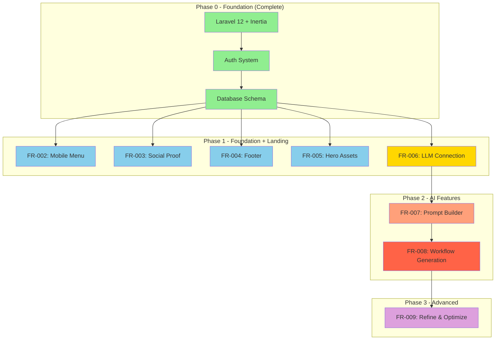
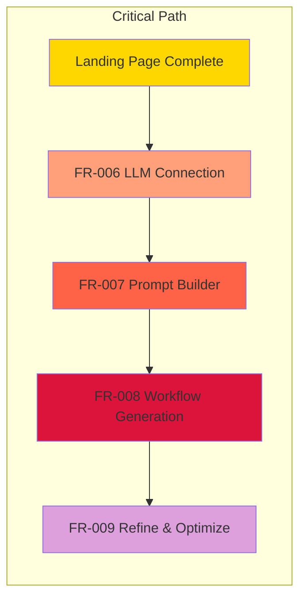
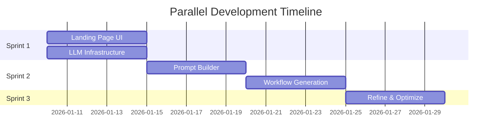
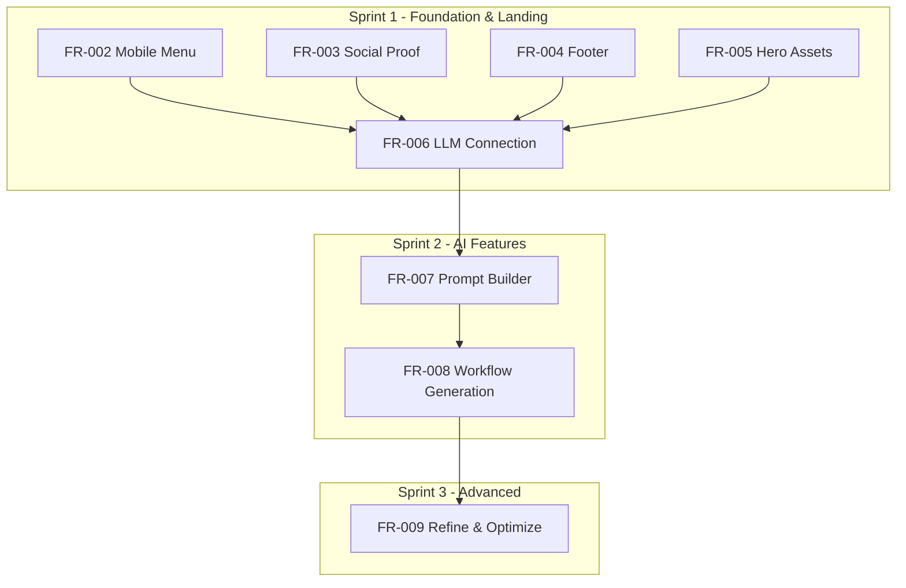

# Implementation Order Guide: AI Workflow Generator

**Document Version**: 1.0  
**Created**: 2026-01-10  
**Last Updated**: 2026-01-10

---

## Executive Summary

This document establishes the strategic implementation order for the AI Workflow Generator application. The implementation follows a **dependency-based, layer-aware approach** that prioritizes core infrastructure before features, and establishes the LLM foundation before dependent AI features.

**Key Implementation Principles**:

1. **Architecture Layer Order**: Domain → Data → Presentation
2. **Feature Dependency Order**: Infrastructure → Core Features → Advanced Features
3. **MVP Priority**: Landing page completion first, AI features second
4. **Parallel Development**: Landing page components can be developed in parallel with LLM infrastructure

**Technology Stack**: Laravel 12 + Inertia v2 + Vue 3 + Pest 4

---

## Implementation Principles

### Dependency-Based Ordering

- Build foundational infrastructure before features that depend on it
- Resolve circular dependencies before implementation
- Use interface segregation to allow parallel development

### Layer-Based Ordering (Clean Architecture)

```
Domain Layer (Business Logic)     ← First
    ↓
Data Layer (Repositories)         ← Second
    ↓
Presentation Layer (UI/Components) ← Third
```

### MVP-F Approach

- **M**inimum **V**iable **P**roduct-**F**irst: Focus on core value proposition
- Defer advanced features (FR-009) to post-MVP
- Complete landing page (FR-001-FR-005) before advanced AI features

### Test-Driven Development Order

1. Domain entities → Unit tests
2. Data layer → Integration tests
3. Presentation layer → Widget/component tests
4. Feature tests → End-to-end tests

### Sprint-Aligned Sequencing

- Sprint 1: Foundation + Landing Page completion
- Sprint 2: AI Features (Prompt → Workflow)
- Sprint 3+: Advanced features (Refine & Optimize)

---

## Implementation Phases

### Phase 0: Project Foundation (Completed)

| Component                 | Status | Notes                                    |
| ------------------------- | ------ | ---------------------------------------- |
| Laravel 12 initialization | ✅     | Base framework installed                 |
| Inertia v2 setup          | ✅     | SSR and client-side rendering configured |
| Vue 3 integration         | ✅     | Components architecture established      |
| Database (SQLite)         | ✅     | Migration and schema complete            |
| Authentication (Fortify)  | ✅     | User auth system operational             |
| Frontend build (Vite)     | ✅     | Asset compilation working                |

**Status**: ✅ Complete

---

### Phase 1: Landing Page Completion & LLM Foundation

**Estimated Duration**: 1 week (Sprint 1)  
**Total Story Points**: 18

#### Phase 1.1: Landing Page Components (10 points)

| Feature                       | Points | Priority  | Dependencies |
| ----------------------------- | ------ | --------- | ------------ |
| FR-002: Mobile Hamburger Menu | 3      | 🟠 High   | None         |
| FR-003: Social Proof Section  | 3      | 🟡 Medium | None         |
| FR-004: Footer Expansion      | 2      | 🟡 Medium | None         |
| FR-005: Hero Visual Assets    | 2      | 🟡 Medium | None         |

#### Phase 1.2: LLM Infrastructure (8 points)

| Feature                | Points | Priority | Dependencies    |
| ---------------------- | ------ | -------- | --------------- |
| FR-006: LLM Connection | 8      | 🟠 High  | Auth (complete) |

#### Phase 1.3: Parallel Development Opportunities

Landing page components (FR-002-FR-005) can be developed **in parallel** with LLM infrastructure (FR-006) since they share no dependencies. This allows multiple developers/agents to work simultaneously.

**Parallel Workstreams**:

- **Workstream A**: Frontend developers → Landing page UI components
- **Workstream B**: Backend developers → LLM provider integration

---

### Phase 2: Prompt Builder & Workflow Generation

**Estimated Duration**: 1 week (Sprint 2)  
**Total Story Points**: 21

#### Phase 2.1: Prompt Creation (8 points)

| Feature                    | Points | Priority | Dependencies            |
| -------------------------- | ------ | -------- | ----------------------- |
| FR-007: Create Your Prompt | 8      | 🟠 High  | FR-006 (LLM Connection) |

#### Phase 2.2: Workflow Generation (13 points)

| Feature                   | Points | Priority | Dependencies            |
| ------------------------- | ------ | -------- | ----------------------- |
| FR-008: Generate Workflow | 13     | 🟠 High  | FR-007 (Prompt Builder) |

#### Phase 2.3: Sequential Dependency

```
FR-006 (LLM) → FR-007 (Prompt) → FR-008 (Workflow)
```

**Note**: FR-008 depends on FR-007, which depends on FR-006. This phase must be sequential.

---

### Phase 3: Refinement & Export (Post-MVP)

**Estimated Duration**: 1 week (Sprint 3)  
**Total Story Points**: 8

| Feature                   | Points | Priority  | Dependencies      |
| ------------------------- | ------ | --------- | ----------------- |
| FR-009: Refine & Optimize | 8      | 🟡 Medium | FR-008 (Workflow) |

---

## Dependencies Map



---

## Critical Path Items

The following items **must** be completed before other work can proceed:



### Critical Path Order

| Order | Item                         | Blocks               |
| ----- | ---------------------------- | -------------------- |
| 1     | Landing Page (FR-002-FR-005) | User-facing features |
| 2     | FR-006 LLM Connection        | All AI features      |
| 3     | FR-007 Prompt Builder        | FR-008 Workflow      |
| 4     | FR-008 Workflow Generation   | FR-009 Refinement    |

---

## Parallel Development Opportunities



### Parallel Workstreams

| Workstream     | Tasks                            | Can Start    | Blocks         |
| -------------- | -------------------------------- | ------------ | -------------- |
| **Frontend A** | FR-002, FR-003, FR-004, FR-005   | Day 1        | None           |
| **Backend A**  | FR-006 (LLM models, controllers) | Day 1        | FR-007, FR-008 |
| **Frontend B** | FR-007 UI components             | After FR-006 | FR-008 UI      |
| **Full-Stack** | FR-008 workflow logic + UI       | After FR-007 | FR-009         |

---

## Risk Mitigation Order

High-risk items should be tackled **early** in the implementation:

### Priority 1: Early Sprint 1

| Risk                           | Item         | Mitigation                                                 |
| ------------------------------ | ------------ | ---------------------------------------------------------- |
| **LLM Integration Complexity** | FR-006       | Implement Ollama first (simpler local HTTP), then DeepSeek |
| **API Key Security**           | FR-006       | Use Laravel encryption, audit before release               |
| **Real-time Validation**       | All features | Implement validation patterns early (see UX docs)          |

### Priority 2: Early Sprint 2

| Risk                   | Item                     | Mitigation                                       |
| ---------------------- | ------------------------ | ------------------------------------------------ |
| **LLM Prompt Quality** | FR-007, FR-008           | Iterative prompt engineering, user feedback loop |
| **UI Complexity**      | FR-008 ordering selector | Use established patterns from UX documentation   |

### Priority 3: Post-Sprint 2

| Risk                            | Item         | Mitigation                                       |
| ------------------------------- | ------------ | ------------------------------------------------ |
| **Export Format Compatibility** | FR-009       | Test formats early, use established libraries    |
| **Performance at Scale**        | All features | Add caching, optimize queries after load testing |

---

## Sprint Mapping



### Sprint Summary Table

| Sprint | Focus                         | Points | Duration | Goal                                           |
| ------ | ----------------------------- | ------ | -------- | ---------------------------------------------- |
| 1      | Landing Page + LLM Foundation | 18     | 1 week   | Complete landing, establish AI infrastructure  |
| 2      | Prompt Builder + Workflow     | 21     | 1 week   | Enable prompt creation and workflow generation |
| 3      | Refinement + Export           | 8      | 1 week   | Add optimization and export capabilities       |

**Total MVP Points**: 39  
**Estimated Timeline**: 3 weeks

---

## Post-MVP Roadmap

The following features are **deferred** until after MVP completion:

### Priority 1: Post-MVP Sprint 4+

| Feature                        | Points | Dependencies | Description                                    |
| ------------------------------ | ------ | ------------ | ---------------------------------------------- |
| FR-009: Refine & Optimize      | 8      | FR-008       | AI-powered suggestions and multi-format export |
| Workflow Execution/Tracking    | TBD    | FR-008       | Execute and monitor workflow progress          |
| Workflow Sharing/Collaboration | TBD    | FR-008       | Share workflows with team members              |

### Priority 2: Future Enhancements

| Feature                  | Description                                            |
| ------------------------ | ------------------------------------------------------ |
| Additional LLM Providers | OpenAI, Anthropic, Google Gemini                       |
| Prompt Library           | Community-shared templates                             |
| Advanced Analytics       | Usage metrics and performance insights                 |
| Mobile App               | Native iOS/Android applications                        |
| Cloud Sync               | Cross-device synchronization (requires auth expansion) |

---

## Technical Reference Matrix

### By Architecture Layer

| Layer            | Components                                   | Sprint  |
| ---------------- | -------------------------------------------- | ------- |
| **Domain**       | LlmProvider, PromptTemplate, Workflow models | 1, 2    |
| **Data**         | Repositories, Migrations, Seeders            | 1, 2    |
| **Presentation** | Vue Components, Pages, Layouts               | 1, 2, 3 |

### By Feature

| Feature | Models                    | Controllers        | Components            | Tests          |
| ------- | ------------------------- | ------------------ | --------------------- | -------------- |
| FR-002  | -                         | -                  | HamburgerMenu.vue     | Unit           |
| FR-003  | -                         | -                  | SocialProof.vue       | Unit           |
| FR-004  | -                         | -                  | Footer.vue            | Unit           |
| FR-005  | -                         | -                  | HeroSection.vue       | Unit           |
| FR-006  | LlmProvider               | LlmController      | LlmSettings.vue       | Unit + Feature |
| FR-007  | PromptTemplate            | PromptController   | PromptBuilder.vue     | Unit + Feature |
| FR-008  | Workflow, WorkflowPersona | WorkflowController | WorkflowGenerator.vue | Unit + Feature |
| FR-009  | WorkflowSuggestion        | WorkflowOptimizer  | WorkflowOptimizer.vue | Unit + Feature |

---

## Definition of Done for Each Phase

### Phase 1 Done Criteria

- [ ] All landing page components (FR-002-FR-005) responsive and accessible
- [ ] LLM connection page operational with Ollama and DeepSeek support
- [ ] API keys encrypted and secure
- [ ] Connection test functionality working
- [ ] All unit tests passing (>80% coverage)

### Phase 2 Done Criteria

- [ ] Prompt builder with templates and real-time preview
- [ ] Workflow generation with 3-ordering comparison
- [ ] Drag-and-drop workflow editor
- [ ] Persona dependency management
- [ ] All feature tests passing

### Phase 3 Done Criteria

- [ ] AI-powered optimization suggestions
- [ ] Multi-format export (JSON, Markdown, CSV, PDF)
- [ ] Workflow history and versioning
- [ ] Integration tests passing

---

## Document References

| Document                | Path                                               | Purpose                |
| ----------------------- | -------------------------------------------------- | ---------------------- |
| UX Design Documentation | `docs/ux/ux-design-documentation.md`               | UI/UX specifications   |
| Sprint 1 Plan           | `sprints/sprint-01-landing-page-llm-foundation.md` | Sprint 1 tasks         |
| Sprint 2 Plan           | `sprints/sprint-02-prompt-workflow.md`             | Sprint 2 tasks         |
| Product Backlog         | `backlog/product-backlog.md`                       | Feature prioritization |
| Feature Requests        | `backlog/features/FR-*.md`                         | Detailed requirements  |

---

## Document History

| Version | Date       | Changes                               |
| ------- | ---------- | ------------------------------------- |
| 1.0     | 2026-01-10 | Initial implementation order document |

---

_Document maintained by: Scrum Master_  
_For questions or updates, contact: Project Lead_
