# Sprint Overview: AI Workflow Generator

**Document Version**: 1.0  
**Created**: 2026-01-10  
**Last Updated**: 2026-01-10

---

## Executive Summary

This document provides a high-level overview of all sprints for the AI Workflow Generator project. It includes sprint summaries, dependency visualizations, and timeline planning to guide the development team through the MVP release.

**Total MVP Scope**: 39 story points across 2 sprints  
**Estimated Timeline**: 3 weeks  
**Post-MVP**: 8+ story points for advanced features

---

## Sprint Summary Table

| Sprint | Name                                 | Focus Area                        | Points | Duration | Start Date | End Date   | Goal                                            |
| ------ | ------------------------------------ | --------------------------------- | ------ | -------- | ---------- | ---------- | ----------------------------------------------- |
| 1      | Landing Page & LLM Foundation        | UI Completion + AI Infrastructure | 18     | 1 week   | 2026-01-13 | 2026-01-17 | Complete landing page, establish LLM foundation |
| 2      | Prompt Builder & Workflow Generation | AI Features                       | 21     | 1 week   | 2026-01-20 | 2026-01-24 | Enable prompt creation and workflow generation  |
| 3      | Refine & Optimize (Post-MVP)         | Advanced Features                 | 8      | 1 week   | TBD        | TBD        | Add optimization and export capabilities        |

**Total MVP Points**: 39  
**Total Project Points**: 47+

---

## Sprint Timeline

---

## Sprint Dependencies

### Dependency Legend

```mermaid
flowchart LR
    subgraph "Status"
        A[🟢 Landing Page] --> B[🟡 LLM Infra]
        B --> C[🟠 Prompt Builder]
        C --> D[🔴 Workflow Gen]
        D --> E[🟣 Post-MVP]
    end

    style A fill:#90EE90
    style B fill:#FFD700
    style C fill:#FFA07A
    style D fill:#FF6347
    style E fill:#DDA0DD
```

---

## Feature Progress Matrix

| Feature                       | Sprint | Points | Status | Dependencies    |
| ----------------------------- | ------ | ------ | ------ | --------------- |
| FR-001: Landing Home Page     | 1      | 5      | ✅     | None            |
| FR-002: Mobile Hamburger Menu | 1      | 3      | ✅     | None            |
| FR-003: Social Proof Section  | 1      | 3      | ✅     | None            |
| FR-004: Footer Expansion      | 1      | 2      | ✅     | None            |
| FR-005: Hero Visual Assets    | 1      | 2      | ✅     | None            |
| FR-006: LLM Connection        | 1      | 8      | ✅     | Auth (complete) |
| FR-007: Create Your Prompt    | 2      | 8      | ⭕     | FR-006          |
| FR-008: Generate Workflow     | 2      | 13     | ⭕     | FR-007          |
| FR-009: Refine & Optimize     | 3      | 8      | ⭕     | FR-008          |

**Status Legend**: ⭕ Not Started | ⏳ In Progress | ✅ Completed

---

## Points by Category

### By Sprint

### By Priority

| Priority    | Sprint 1                   | Sprint 2            | Sprint 3   | Total  |
| ----------- | -------------------------- | ------------------- | ---------- | ------ |
| 🔴 Critical | 0                          | 0                   | 0          | 0      |
| 🟠 High     | 11 (FR-002, FR-006)        | 21 (FR-007, FR-008) | 0          | 32     |
| 🟡 Medium   | 7 (FR-003, FR-004, FR-005) | 0                   | 8 (FR-009) | 15     |
| **Total**   | **18**                     | **21**              | **8**      | **47** |

---

## Critical Path

### Critical Path Items

| Order | Item                         | Sprint | Must Complete Before |
| ----- | ---------------------------- | ------ | -------------------- |
| 1     | Landing Page Components      | 1      | LLM features         |
| 2     | LLM Connection (FR-006)      | 1      | All AI features      |
| 3     | Prompt Builder (FR-007)      | 2      | Workflow Generation  |
| 4     | Workflow Generation (FR-008) | 2      | Refinement           |
| 5     | Refine & Optimize (FR-009)   | 3      | Post-MVP features    |

---

## Parallel Development Opportunities

### Workstream Assignments

| Workstream          | Tasks                                 | Can Start    | Blocks         |
| ------------------- | ------------------------------------- | ------------ | -------------- |
| **Frontend Team**   | FR-002, FR-003, FR-004, FR-005        | Day 1        | None           |
| **Backend Team**    | FR-006 (Models, Controllers, Service) | Day 1        | FR-007, FR-008 |
| **Full-Stack Team** | FR-007 UI + API                       | After FR-006 | FR-008         |
| **Specialist**      | FR-008 Workflow Logic                 | After FR-007 | FR-009         |

---

## Sprint Capacity Planning

### Sprint 1 (18 points)

| Day       | Focus                                           | Estimated Points |
| --------- | ----------------------------------------------- | ---------------- |
| Monday    | Sprint planning, start LLM models + Mobile menu | 5                |
| Tuesday   | Continue LLM service + Social proof             | 5                |
| Wednesday | LLM UI components + Footer                      | 4                |
| Thursday  | Testing + Hero assets completion                | 3                |
| Friday    | Bug fixes, code review, sprint review           | 1                |

### Sprint 2 (21 points)

| Day       | Focus                                    | Estimated Points |
| --------- | ---------------------------------------- | ---------------- |
| Monday    | Prompt models + Prompt builder UI        | 5                |
| Tuesday   | Template library + Preview functionality | 5                |
| Wednesday | Workflow models + Generation service     | 5                |
| Thursday  | Workflow builder UI + Drag-drop          | 5                |
| Friday    | Testing, integration, sprint review      | 1                |

---

## Quality Gates per Sprint

### Sprint 1 Quality Gates

- [ ] Landing page responsive on all breakpoints
- [ ] LLM connection tests pass for Ollama and DeepSeek
- [ ] API keys encrypted in database
- [ ] Code coverage > 80%
- [ ] No critical accessibility violations

### Sprint 2 Quality Gates

- [ ] Prompt preview updates in < 100ms
- [ ] Workflow generation completes in < 30 seconds
- [ ] Drag-and-drop smooth (60fps)
- [ ] Widget tests for all Vue components
- [ ] Code coverage > 80%

### Sprint 3 Quality Gates

- [ ] Export formats validated (JSON, Markdown, CSV, PDF)
- [ ] Suggestion acceptance rate > 70%
- [ ] Integration tests pass
- [ ] Performance benchmarks met

---

## Risk Register

| Risk                 | Sprint | Impact | Probability | Mitigation                           |
| -------------------- | ------ | ------ | ----------- | ------------------------------------ |
| LLM API changes      | 1, 2   | High   | Medium      | Abstract provider behind interface   |
| UX complexity        | 2      | Medium | High        | Early user testing, iterative design |
| Performance at scale | 2, 3   | Medium | Low         | Caching strategy, query optimization |
| Scope creep          | All    | High   | Medium      | Strict backlog grooming, MVP focus   |

---

## Definition of Done - Project Level

- [ ] All Sprint 1-2 features complete and tested
- [ ] User can create account and connect LLM
- [ ] User can create prompts and generate workflows
- [ ] User can save and export workflows
- [ ] Code coverage > 80%
- [ ] No critical or high bugs
- [ ] Deployed to production
- [ ] Documentation complete

---

## Post-MVP Features

| Feature                   | Sprint | Points | Description                         |
| ------------------------- | ------ | ------ | ----------------------------------- |
| FR-009: Refine & Optimize | 3+     | 8      | AI suggestions, multi-format export |
| Workflow Execution        | 4+     | TBD    | Execute and track workflow progress |
| Workflow Sharing          | 4+     | TBD    | Team collaboration features         |
| Additional LLM Providers  | 4+     | TBD    | OpenAI, Anthropic, Gemini           |
| Mobile App                | 5+     | TBD    | Native iOS/Android                  |

---

## Reference Documents

| Document                 | Path                                               | Purpose                |
| ------------------------ | -------------------------------------------------- | ---------------------- |
| Implementation Order     | `sprints/implementation-order.md`                  | Strategic foundation   |
| Sprint 1 Plan            | `sprints/sprint-01-landing-page-llm-foundation.md` | Sprint 1 tasks         |
| Sprint 2 Plan            | `sprints/sprint-02-prompt-workflow.md`             | Sprint 2 tasks         |
| UX Design Documentation  | `docs/ux/ux-design-documentation.md`               | UI/UX specifications   |
| Product Backlog          | `backlog/product-backlog.md`                       | Feature prioritization |
| Sprint Planning Template | `docs/templates/sprint-planning-template.md`       | Template reference     |

---

## Document History

| Version | Date       | Changes                          |
| ------- | ---------- | -------------------------------- |
| 1.0     | 2026-01-10 | Initial sprint overview document |

---

_Document maintained by: Scrum Master_  
_For questions or updates, contact: Project Lead_
